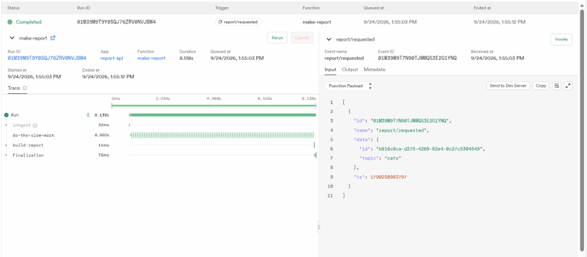
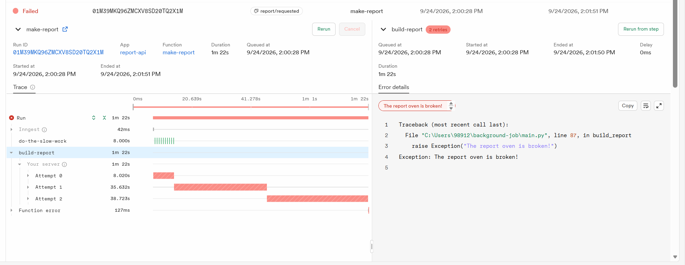
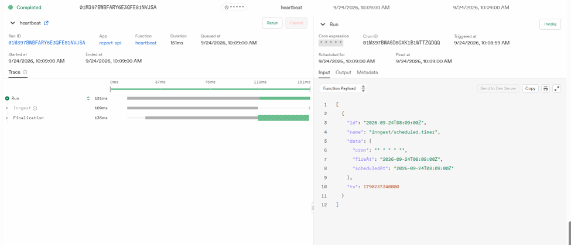

# Background Job API

A small FastAPI project demonstrating background jobs with Inngest.

The API accepts report requests immediately, while the slow report generation happens in the background. Clients can check the report status using a separate endpoint.

## What this project demonstrates

- FastAPI endpoints
- Background jobs
- Events
- HTTP 202 Accepted
- Status polling
- Retries and backoff
- Input validation
- Cron jobs
- Inngest Dev Server

## Setup

Create and activate a virtual environment:

```powershell
python -m venv venv
venv\Scripts\activate
```

Install dependencies:

```powershell
pip install fastapi uvicorn inngest
```

## Run the project

### Terminal 1 — FastAPI

```powershell
venv\Scripts\activate
$env:INNGEST_DEV="1"
uvicorn main:app --reload --port 8000
```

The API runs at:

```text
http://localhost:8000
```

### Terminal 2 — Inngest Dev Server

Make sure Docker Desktop is running.

```powershell
docker run -p 8288:8288 -p 8289:8289 inngest/inngest inngest dev -u http://host.docker.internal:8000/api/inngest
```

The Inngest dashboard runs at:

```text
http://localhost:8288
```

## API Endpoints

| Method | Endpoint | Purpose |
|---|---|---|
| GET | `/health` | Check that the API is running |
| POST | `/reports` | Create a report and start the background job |
| GET | `/reports/{id}` | Check the status and result of a report |
| POST | `/api/inngest` | Used internally by Inngest |

## Inngest Functions

| Function | Trigger | Purpose |
|---|---|---|
| `say-hello` | `test/hello` event | Simple background-job test |
| `make-report` | `report/requested` event | Builds a report in the background |
| `heartbeat` | `* * * * *` cron | Runs every minute and summarizes report statuses |

## Background Job Flow

A client sends:

```text
POST /reports
```

The API immediately returns:

```json
{
  "id": "c19d35c7-ee11-4d7f-ba54-96fbb4ecaaa2",
  "status": "pending"
}
```

The response uses HTTP `202 Accepted`.

The report initially has:

```text
status: pending
```

Inngest performs the slow work in the background.

After the job finishes:

```json
{
  "id": "c19d35c7-ee11-4d7f-ba54-96fbb4ecaaa2",
  "topic": "cats",
  "status": "done",
  "result": "Report about cats"
}
```

This demonstrates the pattern:

```text
accept fast → work in background → report status
```

## Retries and Validation

A report with the topic:

```json
{
  "topic": "fail"
}
```

intentionally throws an error.

The `make-report` function has:

```python
retries=2
```

so Inngest performs three attempts in total:

```text
Attempt 0
Attempt 1
Attempt 2
```

before the run ends as Failed.

Invalid input is different from a temporary job failure. A request with no topic is rejected immediately with HTTP `400`, while temporary background-job failures are retried automatically.

## Cron Job

The `heartbeat` function runs every minute during testing:

```text
* * * * *
```

It reports how many reports are:

- pending
- done
- failed

A cron expression for every day at 08:00 is:

```text
0 8 * * *
```

A cron expression for every Sunday at 22:00 is:

```text
0 22 * * 0
```

Cron schedules depend on the server timezone, so the timezone should always be checked.

## Dashboard Proof

The Inngest dashboard shows:

- successful `make-report` runs
- failed `make-report` runs with retries
- `heartbeat` runs occurring once per minute

### Screenshot

## Dashboard Proof

### Successful background job



### Failed job with retries



### Cron heartbeat



```markdown

```